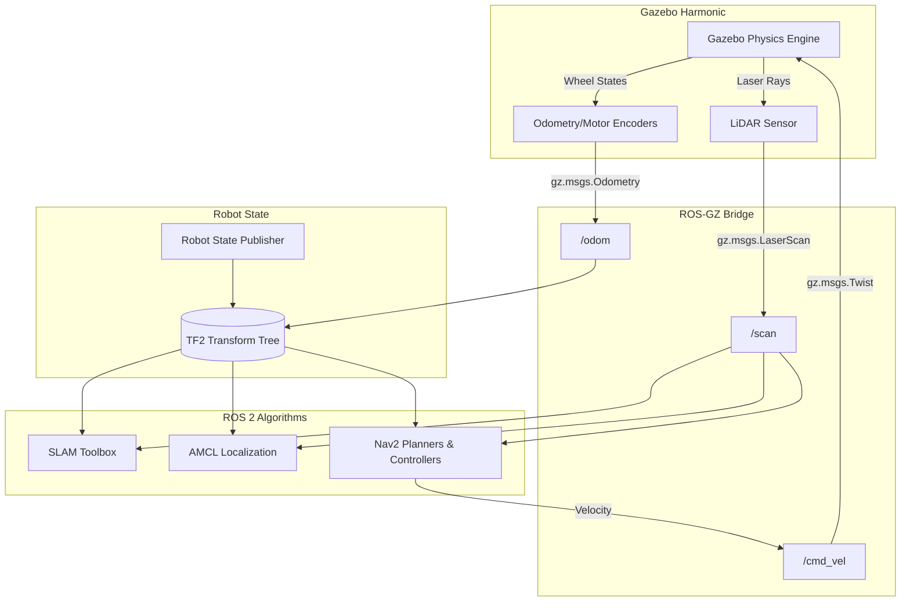
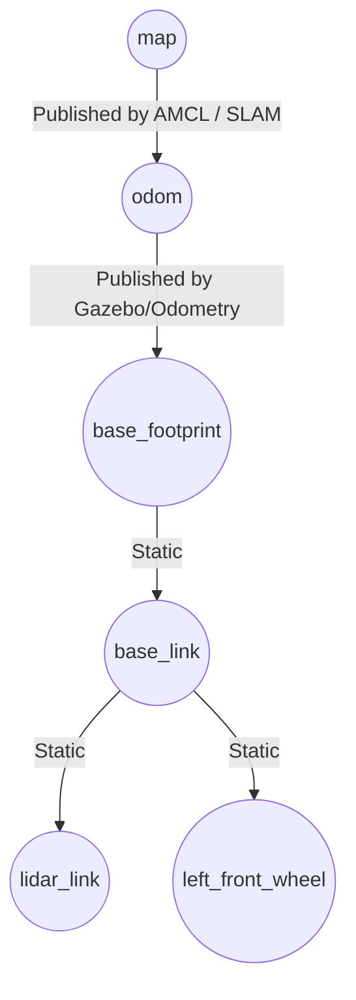
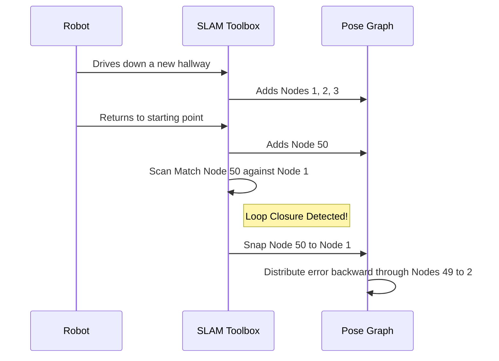
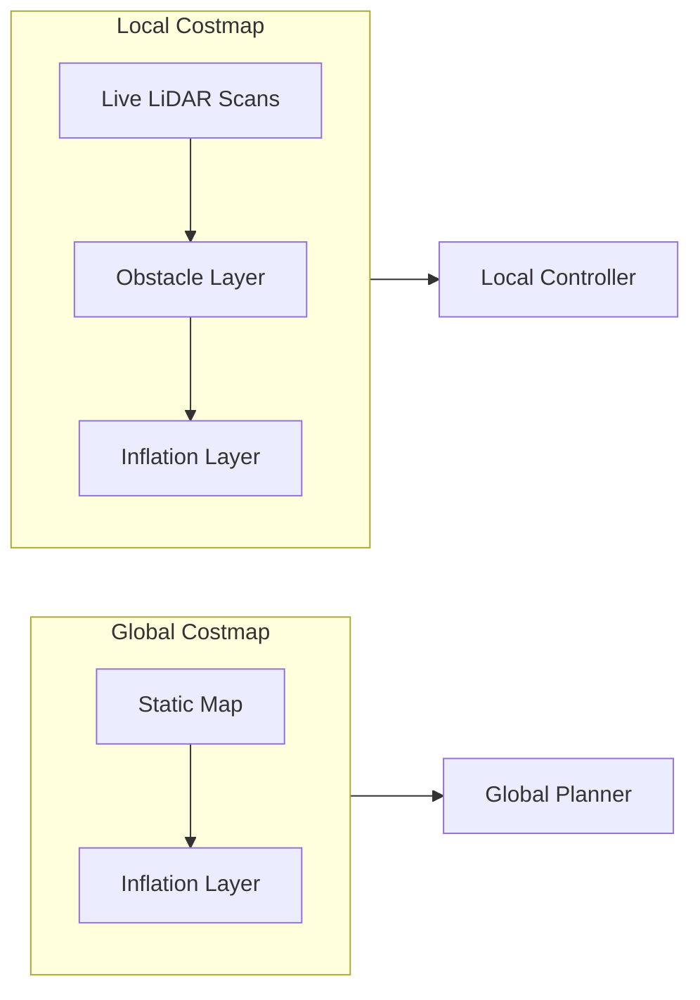

# Alpha Robot System Architecture & Theory Deep Dive

This document provides a comprehensive theoretical breakdown and architectural mapping of the Alpha Robot pipeline, including precise node-graph interactions, data flow, and underlying algorithms.

---

## High-Level System Architecture

At a macro level, the system is separated into three distinct layers: the **Physical/Simulated Hardware Layer** (Gazebo), the **State & Transformation Layer** (TF2 / Robot State Publisher), and the **Algorithmic Layer** (SLAM & Nav2).

---

## 1. Robot Description & Transform Tree (TF2)

The foundation of any ROS 2 robot is its **TF2 (Transform) Tree**. Sensors and motors are mounted at different physical locations. The `robot_state_publisher` reads the URDF and mathematically binds all these components together.

### The TF Tree Data Flow

*   **`map` -> `odom`**: Odometry drifts over time because wheels slip. SLAM or AMCL calculate this drift and publish the `map -> odom` transform to pull the robot back into its true global position.
*   **`odom` -> `base_footprint`**: This is the raw movement estimated purely from wheel rotations.
*   **`base_link` -> `lidar_link`**: Allows the algorithms to know that an obstacle detected 1 meter in front of the LiDAR is actually 1.2 meters in front of the center of the robot.

---

## 2. Gazebo Harmonic Simulation

Gazebo Harmonic calculates the real-time physics (gravity, friction, collisions) of the robot. 

Because Gazebo uses its own internal pub/sub system, we use `ros_gz_bridge`. The bridge translates Gazebo Protobuf messages into standard ROS 2 `.msg` formats.

### Mecanum Drive Physics
Alpha uses a **Mecanum Drive** plugin. Unlike a differential drive robot (which must rotate to turn), mecanum wheels have 45-degree rollers. By spinning the left and right wheels in opposite directions, the physics engine generates lateral (strafing) force. This makes the robot **holonomic** (can move in X, Y, and Theta simultaneously).

---

## 3. Mapping: SLAM Toolbox Deep Dive

SLAM Toolbox utilizes **Graph-Based SLAM** (specifically using the Karto algorithm under the hood).

### How Graph-SLAM Works
1.  **Nodes**: Every few seconds, SLAM creates a "node" representing the robot's pose and attaches the current LiDAR scan to it.
2.  **Edges**: As the robot moves, odometry creates "edges" (connections) between these nodes.
3.  **Scan Matching**: SLAM compares the newest LiDAR scan with the previous scans. If they align perfectly, it trusts the odometry. If they don't, it mathematically warps the odometry to force the scans to align.

### Loop Closure

When the robot returns to a previously mapped area, SLAM detects a match (Loop Closure). It realizes the odometry drifted by 2 meters, so it "snaps" the current position back to the old one and recursively corrects the entire map history.

---

## 4. Navigation: Nav2 Stack

The Nav2 Stack is built on a **Behavior Tree (BT)** architecture. Instead of a single monolithic script, Nav2 executes a tree of XML logic (e.g., "Compute Path" -> "Follow Path" -> If Stuck -> "Spin Recovery").

### A. Localization (AMCL)
AMCL (Adaptive Monte Carlo Localization) uses a **Particle Filter**.
1.  **Initialization**: AMCL scatters 3,000 particles randomly across the static map.
2.  **Prediction**: When the robot moves 1 meter forward (via `/odom`), every particle is shifted 1 meter forward.
3.  **Update**: AMCL takes the live LiDAR scan and projects it from the perspective of *every single particle*. 
4.  **Resampling**: Particles where the projected laser hits a wall on the static map are given a high weight. Particles where the laser hits empty space die off. Over time, the particles clump together at the true location.
*   **OmniMotionModel**: Because Alpha is a Mecanum robot, it can slip sideways. We use the OmniMotionModel so AMCL doesn't instantly kill particles that drift horizontally.

### B. Dual Costmap Architecture
Costmaps translate the physical world into a 2D grid of "costs" (0 = free space, 254 = obstacle, 255 = lethal/unknown).

*   **Global Costmap**: Static. It inflates the walls massively to create a smooth "cost gradient" pushing the robot to drive strictly in the center of aisles.
*   **Local Costmap**: A dynamic "rolling window" (e.g., 5x5 meters) centered on the robot. It only cares about immediate live obstacles (like people) avoiding them on the fly.

### C. NavFn (Global Planner) & DWB (Local Controller)

#### 1. Global Planner (NavFn)
NavFn uses **A* (A-Star) or Dijkstra's Algorithm** to calculate the absolute shortest path from Point A to Point B across the Global Costmap. It assumes the world is static and generates a long green line (the Global Plan).

#### 2. Local Controller (DWB - Dynamic Window Approach)
The DWB Controller actually drives the motors. 
1.  **Trajectory Rollout**: DWB simulates hundreds of possible future paths (trajectories) for the next 2.0 seconds based on its current speed and acceleration limits.
2.  **Critic Scoring**: It scores each simulated trajectory using "Critics":
    *   *PathAlign*: Does this path follow the Global Plan? (High priority)
    *   *GoalDist*: Does this path get closer to the goal?
    *   *BaseObstacle*: Does this path crash into anything in the Local Costmap? (Lethal)
3.  **Execution**: It selects the highest-scoring trajectory and publishes the corresponding X, Y, and Theta velocities to `/cmd_vel`. Because the robot is Mecanum, DWB can be configured to command Y (strafing) velocities to perfectly slide around obstacles.
